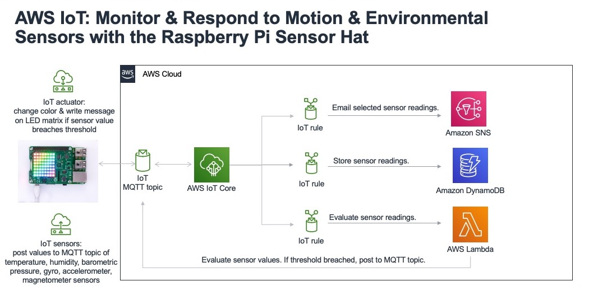

# aws-iot-raspi-sensors

  In this project I use the AWS IoT Core service to monitor and control a Raspberry Pi, over the internet, based on readings of environmental and motion sensors built into the Sense HAT. The Raspberry Pi has built-in support for WiFi which allows it to be connected over the internet to AWS services. The Sense HAT has an array of sensors including: gyroscope, accelerometer, magnetometer, temperature, barometric pressure, and humidity. Additional sensors can be attached to the Raspberry Pi. 
  
  The values of sensor readings are passed from the Raspberry Pi it via an MQTT topic subscribed to by the AWS IoT Core service. An IoT Rule routes the MQTT topic values to SNS, DynamoDB, and Lambda. Lambda then sends back control commands to the MQTT topic when a sensor value goes above or below a certain threshold, set by the developer.
  
  The payload containes the following data items:
  * SENSOR_TYPE = sensor type
  * VALUE = sensor reading
  * NOW: datetime stamp
  * NODE_ID: unique IoT device identifier/serial number

# project video demo
- To see the project in action, watch this YouTube video
-- https://www.youtube.com/watch?v=f7IWtVbQ5dQ

# aws architecture
- Refer to the AWS architecture diagram at the end of this page. 

# project components:
   * Raspberry Pi - https://www.raspberrypi.org/
   * Raspberry Pi Sense Hat - https://www.raspberrypi.org/products/sense-hat/
   * AWS Account - https://portal.aws.amazon.com/billing/signup?type=enterprise#/start
   * Wifi network + internet access

# aws account setup

- Create a Lambda function in your AWS account using this code as basis. Customize as needed including updating with your account specific resource properties such as your SNS Topic ARN and your default region

  https://github.com/scriptbuzz/aws-iot-raspi-sensors/blob/master/IoTLambdaSensorResponse.py

# raspberry pi setup

- Follow the instructions on the AWS guide to install the AWS IoT Python SDK on your Raspberry Pi

  https://docs.aws.amazon.com/greengrass/latest/developerguide/IoT-SDK.html

- The AWS IoT SDK creates a file basicPubSub.py. Update this file based on my code bekow.

  https://github.com/scriptbuzz/aws-iot-raspi-sensors/blob/master/basicPubSub.py

- Create and run the following file

  https://github.com/scriptbuzz/aws-iot-raspi-sensors/blob/master/aws-iot-test01.py

  
